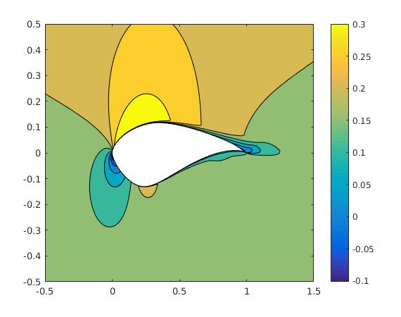
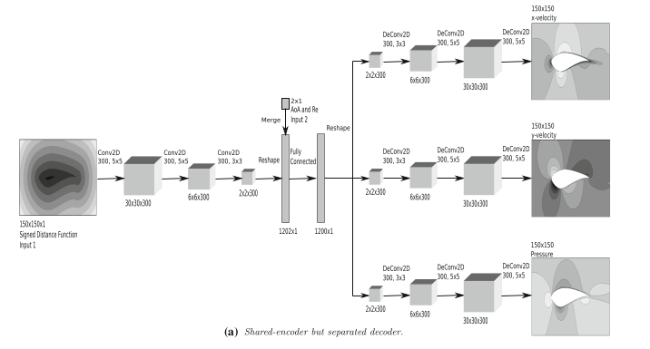
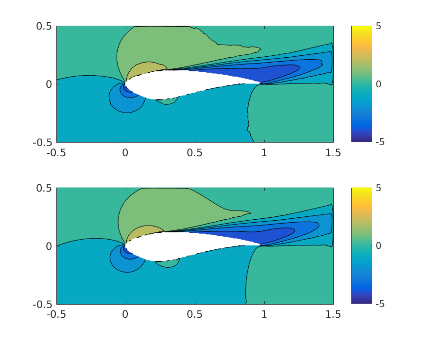

# Deep-Learning-for-Aerodynamic-Prediction
This repository contains scripts used to create and train a deep neural network that replicates a CFD solver for aerodynamic prediction over airfoils. The training data is prepared using a RANS (Reynolds-Averaged Navier-Stokes) solver. The hyperparameters were tuned using a grid search of reasonable values. **The current code is provided and intended as a sample and is not the final version**, which includes loss-function modification and multiple approaches to the deconvolution step.

Aerodynamic flow field over an s814 airfoil.

## Citing this work

If you use this, please cite the following paper:

* Bhatnagar, Afshar, Pan, Duraisamy, Kaushik : _Prediction of aerodynamic flow fields using convolutional neural networks_ (Computational Mechanics, 2019) https://link.springer.com/article/10.1007%2Fs00466-019-01740-0

## Introduction

CFD solvers play an important role today in development and design of products, particularly in mechanical and aerospace engineering. One of the biggest issues with performing high-fidelity simulations is the time to result of such simulations, along with the computational cost of performing the simulation. This project is the foundation of an ambitious project undertaken at the [CASLab](https://caslab.engin.umich.edu/) , University of Michigan to use deep neural networks to predict aerodynamic flow fields around complex vehicle geometries in near-real time as geometry shape is varied. The hypothesis is that the use of a trained neural network enables this, with most of the computational time and effort going into training the network offline. The use of such a tool would drastically improve turnaround times in design and would expand the boundaries of shapes designers would be able to experiment with given current limitations of resources.
In the current work, we test the suitability of using convolutional neural networks(CNNs) to do 2-D prediction of flow fields around airfoil shapes.

## Methodology

The neural network is constructed as a deep neural network, which effectively maps from the input geometry shape and flow conditions to an output of flow fields around the shape. The neural network consists of convolution layers, deconvolution layers and fully connected layers. The inputs and outputs are rectangular matrices, and owing to the structure of the problem the convolution and deconvolution steps are made mirror images of each other, as shown in the figure.

The network is trained on 252 datapoints, containing 3 different shapes, 20 different angles of attack and 4 different flow reynolds numbers. The preprocessed training data was obtained using [TURNS](https://arc.aiaa.org/doi/abs/10.2514/3.49036), a RANS solver which uses the [SA](https://turbmodels.larc.nasa.gov/spalart.html) turbulence model. Data from TURNS is processed using a series of MATLAB scripts, an the final training data is available at the links in the README. The training data flow fields are normalized before training begins to speed up convergence. The set is randomized in order, and then training is done with a specified batch size. A certain fraction of the set is removed from the training process in order to evaluate validation error. We introduce nonlinearity into the system by using a [Swish](https://www.machinecurve.com/index.php/2019/05/30/why-swish-could-perform-better-than-relu/) activation function. Further details can be found [here](https://link.springer.com/article/10.1007%2Fs00466-019-01740-0).

**Depiction of the deep neural network created**

**Visualization of a result of X-velocity from validation set(above) and comparison to true flow(below). Note this result is from a more enhanced network which includes gradient loss penalty in it's loss function**

## Results

Detail of all results obtained can be found [here](https://link.springer.com/article/10.1007%2Fs00466-019-01740-0).

## Files:

- Front_end.py: All major training parameters are modified in this file
- back_end.py: Major functions including those to build and train network based on specified hyper-parameters are included in this function
- The MATLAB files used in data preparation have not been hosted on the Git.
- Data Files(Y):
  - [Output_rho.mat](https://drive.google.com/open?id=1_ctNRiNIIOxGYjDWpLvvXlIOqymNlkOG): Grid-density values for each of the training/validation set points.Set contains 252 points.
  - [Output_u.mat](https://drive.google.com/open?id=1Znny0Xcxh1U5mjomwoDUI2EWo9Bf_miY): Grid-X velocity values for each of the training/validation set points.Set contains 252 points.
  - [Output_v.mat](https://drive.google.com/open?id=1tAfEiq4hrIuMgebKjG3YYPn0qkBJ_Tzm): Grid-Y velocity values for each of the training/validation set points.Set contains 252 points.
  - [Output_p.mat](https://drive.google.com/open?id=1A7Kh-lhZiJLA9_7HpMVd6isfkS_yh9pu): Grid-Pressure values for each of the training/validation set points.Set contains 252 points.
- Data Files(X):
  - [SDF_values.mat](https://drive.google.com/open?id=1HrJhrgdGvfDki4914WIpGZEHICP3u0oU): Grid signed distance function to pass shape of airfoil to network.
  - [input_re_alpha.mat](https://drive.google.com/open?id=1bbLP0lx7TEIl4_-tAs3jo3UogmZPDdhc): Specifies flow variables in the form of reynolds number and angle of attack to the airfoil.
  

